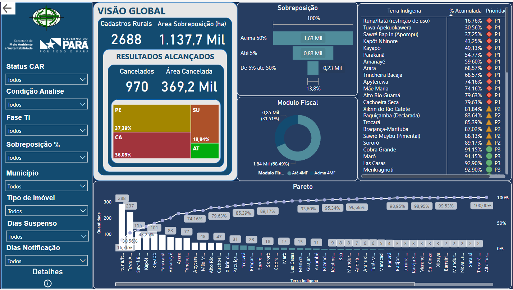
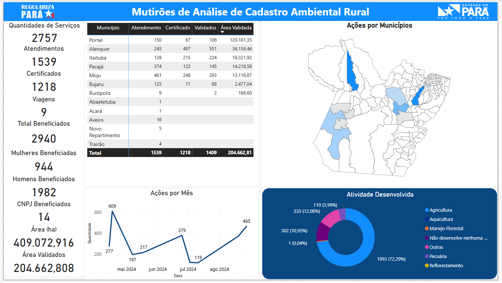
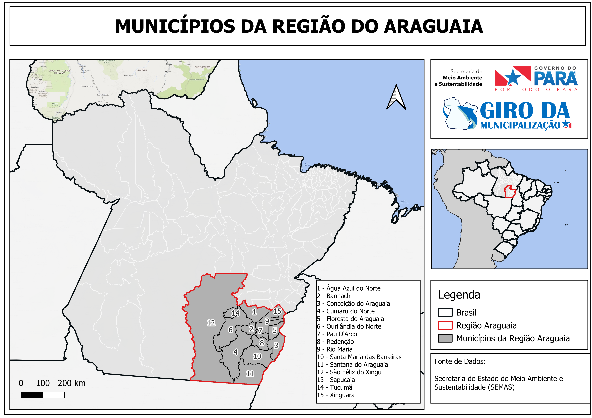
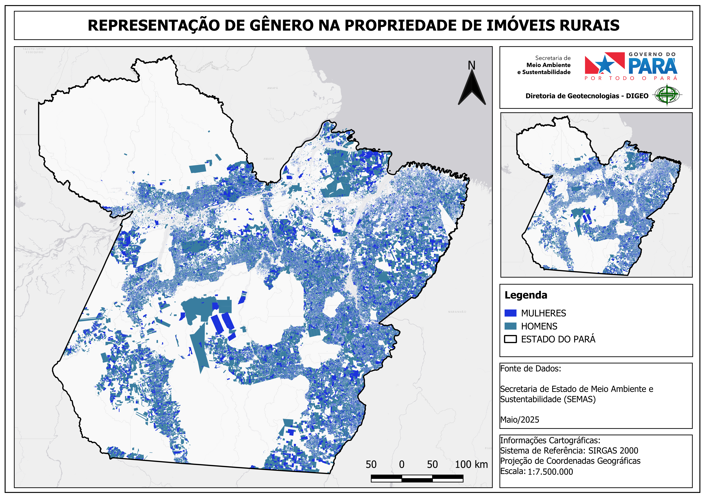
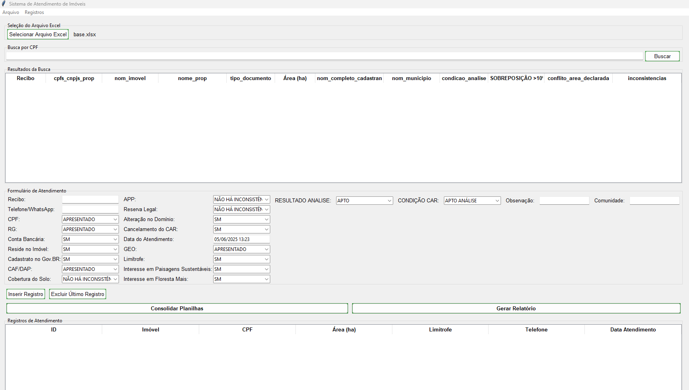
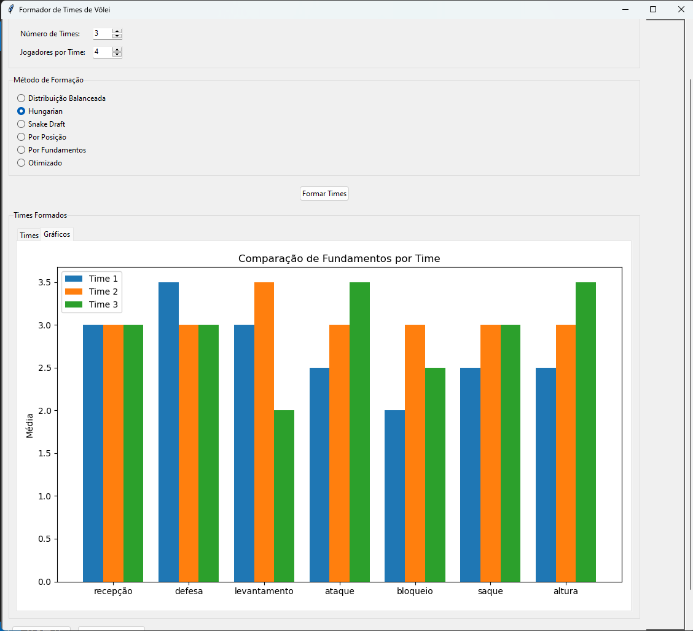

# Elberth Sales - Estatístico / Analista de Dados

#  Sobre Mim

Sou **Estatístico** com atuação em políticas públicas, especialmente na área ambiental e de saúde. Atualmente trabalho como **Técnico em Meio Ambiente e Sustentabilidade na SEMAS/PA**, onde aplico ciência de dados para fortalecer a regularização ambiental e subsidiar decisões estratégicas por meio de análises espaciais, relatórios técnicos e dashboards interativos.

Tenho experiência consolidada em **Power BI, Python, PostgreSQL, QGIS e automação de processos (ETL)**. Possuo formação em Estatística pela UFPA e atualmente curso especialização em Ciência de Dados, com foco em Machine Learning e Engenharia de Dados.

Sou engajado em iniciativas técnicas e sociais, como capacitação de equipes, avaliação educacional institucional (CPA/UFPA) e ações de bem-estar animal no ambiente universitário.

## 🛠️ Ferramentas e Tecnologias Utilizadas

### 📌 Linguagens
- **Python**
- **SQL (PostgreSQL)**

---

### 🐍 Bibliotecas Python

#### 📊 Análise de Dados
- `pandas` – manipulação e análise de dados
- `numpy` – operações numéricas e vetoriais
- `joblib` – paralelização e otimização de performance em loops pesados

#### 📦 Automação e Sistema de Arquivos
- `os` – automação de diretórios e arquivos
- `json` – leitura e escrita de dados estruturados

#### 🌍 Geoespacial
- `geopandas` – análise de dados espaciais com suporte a Shapefiles e GeoJSON
- `shapely` – construção e manipulação de geometrias (pontos, polígonos etc.)
- `h3` – indexação espacial hexagonal (ideal para análises com grids)
- `folium` – visualização interativa de mapas (usando Leaflet.js)
- `matplotlib.pyplot` – criação de mapas e gráficos estáticos

---

### 💾 Banco de Dados
- **PostgreSQL** (com extensão **PostGIS** para dados espaciais)
- `psycopg2` – conexão direta com bancos PostgreSQL
- `sqlalchemy` – abstração para escrita de queries

---

### 📈 Visualização e BI
- **Power BI** – dashboards interativos e relatórios ambientais

---

### 🗃️ Documentos e Relatórios
- `python-docx` – geração automatizada de documentos Word
- `openpyxl` – manipulação de planilhas Excel

---

### 🛠️ Ferramentas de Desenvolvimento
- **Jupyter Notebook** – desenvolvimento de scripts e análises
- **Anaconda** – gerenciamento de pacotes e ambientes
- **Git & GitHub** – controle de versão e portfólio
- **VS Code** – edição de código
- **WPS Office** – documentos e planilhas
- **QGIS** – apoio geoespacial na visualização e edição

- ## 📌 Produtos Desenvolvidos

Resultados e soluções criadas com foco em **análises ambientais, visualização de dados e automação de processos**, especialmente no contexto da **regularização ambiental no Pará**.

---

## 🗺️ Dashboard de Áreas Especiais - Terras Indígenas e Unidades de Conservação

**Descrição:**  
Ferramenta visual interativa desenvolvida para apoiar a gestão ambiental por meio da análise espacial do Cadastro Ambiental Rural (CAR) sobreposto a Terras Indígenas e Unidades de Conservação no estado do Pará.

### 🎯 Utilidade:

- Identifica áreas com sobreposição entre imóveis cadastrados e territórios protegidos.  
- Auxilia na priorização de análises técnicas e na definição de estratégias de regularização fundiária e ambiental.  
- Apoia órgãos gestores e tomadores de decisão na formulação de políticas públicas de proteção territorial.  
- Gera relatórios por município, status do CAR e categoria fundiária sobreposta.  

> 📊 Desenvolvido com dados do SICAR e bases geográficas oficiais, integrando análise estatística e espacial.

---

### 🌱 Dashboard: Mutirões e Alcance Territorial

**Descrição:**  
Painel interativo que monitora a execução dos mutirões de regularização ambiental promovidos pela SEMAS/PA no âmbito do Programa Regulariza Pará, com foco na análise territorial e cobertura das ações.

### 🎯 Utilidade:

- Exibe a abrangência geográfica dos mutirões realizados por município e região.  
- Permite avaliar o volume de atendimentos realizados em campo e sua distribuição espacial.  
- Apoia o planejamento estratégico de futuras ações de regularização, priorizando áreas com maior demanda ou vulnerabilidade.  
- Fornece evidências para prestação de contas e elaboração de relatórios institucionais.  

> 📍 Baseado em dados do SICAR e registros internos da SEMAS/PA, integrando mapas, filtros e estatísticas em tempo real.
---

### 🗂️ Dashboard: Resumo de Dados SICAR

**Descrição:**  
Painel sintético que consolida informações estratégicas do Sistema Nacional de Cadastro Ambiental Rural (SICAR), facilitando a compreensão do cenário ambiental no Pará.

### 📊 Utilidade:

- Exibe indicadores agregados sobre a situação dos imóveis rurais cadastrados no SICAR.  
- Permite o acompanhamento de status dos CARs (pendentes, em análise, analisados, cancelados etc.).  
- Auxilia gestores na identificação de gargalos e na definição de prioridades para análise e validação.  
- Gera insumos para relatórios institucionais e planejamento de políticas públicas de regularização ambiental.

> 🔍 Integra grandes volumes de dados espaciais e tabulares em um painel visual e de fácil interpretação.
> 
---

### 🗺️ Mapa: Região do Araguaia

Mapa temático georreferenciado com destaque para a região do Araguaia.

---

### 👥 Mapa: Distribuição de CAR por Gênero no Pará

### 👥 Mapa: Distribuição de CAR por Gênero no Pará

**Descrição:**  
Representação espacial da titularidade dos Cadastros Ambientais Rurais (CAR) no estado do Pará, segmentada por gênero.

### 🌍 Utilidade:

- Identifica a distribuição territorial dos imóveis cadastrados no CAR por gênero do responsável legal.  
- Contribui para o monitoramento da participação de mulheres na regularização ambiental.  
- Fornece dados para políticas públicas de inclusão e equidade no campo.  
- Auxilia na avaliação de impactos sociais da política ambiental no estado.

> 💡 O mapa é uma ferramenta de diagnóstico socioambiental que revela padrões importantes sobre o perfil dos beneficiários do programa Regulariza Pará.

---

## 🌱 Sistema de Atendimento para Regularização Ambiental - SEMAS/PA

**Descrição:**  
Sistema especializado para agilizar o atendimento técnico do Programa Regulariza Pará, facilitando o registro, análise e gestão de imóveis rurais no Cadastro Ambiental Rural (CAR).

### 🛠️ Principais Funcionalidades:

- ✅ Importação automática da base de imóveis (Excel)  
- 🔍 Busca inteligente por CPF/CNPJ do proprietário  
- 📝 Formulário dinâmico de atendimento com campos:
  - Documentação (CPF, RG, CAF/DAP)  
  - Situação do imóvel (sobreposições, APP, RL)  
  - Observações técnicas  
- 📅 Registro automático de data/hora do atendimento  
- 📤 Exportação de relatórios consolidados (Excel)  
- 🔄 Gestão de registros (edição/exclusão de atendimentos)  

### 💻 Tecnologias Utilizadas:

- Python (`pandas` para dados, `tkinter` para interface)  
- Validações automáticas (CPF, datas)  
- Relatórios personalizáveis com filtros  

### 🌟 Diferenciais:

- Otimiza tempo de atendimento em campo  
- Padroniza informações para análise técnica  
- Integrável com sistemas de georreferenciamento  
- Foco na realidade do agricultor familiar paraense  

> 🛠️ *"Ferramenta essencial para a regularização ambiental no Pará"*  
> 👉 Desenvolvido pela **SEMAS/PA** em parceria com a equipe do **Regulariza Pará**.

📌 *(Sistema em constante evolução - versão 1.0 - maio/2025)*

## 🏐 Hobby: Vôlei + Análise de Dados

Fora do trabalho, sou apaixonado por jogar vôlei. Aproveitei esse interesse para aplicar minhas habilidades em análise de dados e desenvolvi um sistema de **montagem de times equilibrados**, com base em algoritmos que consideram notas de desempenho dos jogadores.

**Descrição:**  
Sistema inteligente para criação de times equilibrados de vôlei com base em habilidades técnicas dos jogadores, desenvolvido para otimizar a distribuição de atletas em treinos e competições.

### 🛠️ Principais Funcionalidades:

- ✅ Importação automática de dados de jogadores (planilha Excel)  
- 🔢 5 algoritmos diferentes para formação de times  
- 📊 Cálculo automático de notas ponderadas por fundamento  
- 📈 Visualização gráfica do equilíbrio entre times  
- 💾 Exportação dos times gerados (formato JSON)  
- 🧩 Interface simples para ajustes manuais  

### 💻 Tecnologias Utilizadas:

- Python (`pandas`, `numpy`)  
- Tkinter (interface gráfica)  
- Matplotlib (visualização)  
- Scipy (otimização)

### 🌟 Diferenciais:

- Combina análise estatística com conhecimento esportivo  
- Flexível para diferentes estratégias de formação  
- Gera relatórios comparativos entre métodos

---
📫 **Contato:** elberthdata@gmail.com  
🔗 [LinkedIn](https://www.linkedin.com/in/elberthsales) • [GitHub](https://github.com/Btosales2203903)

  
